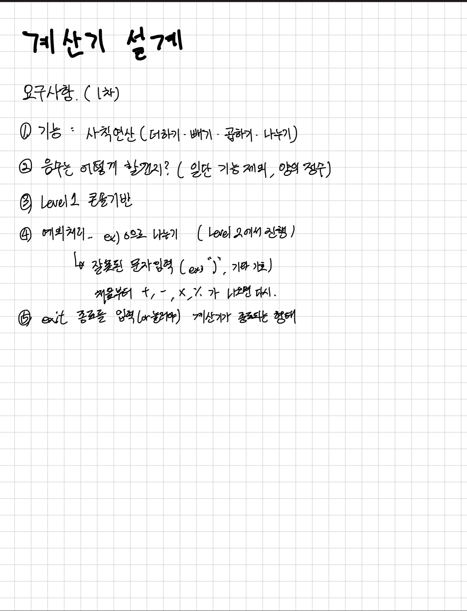
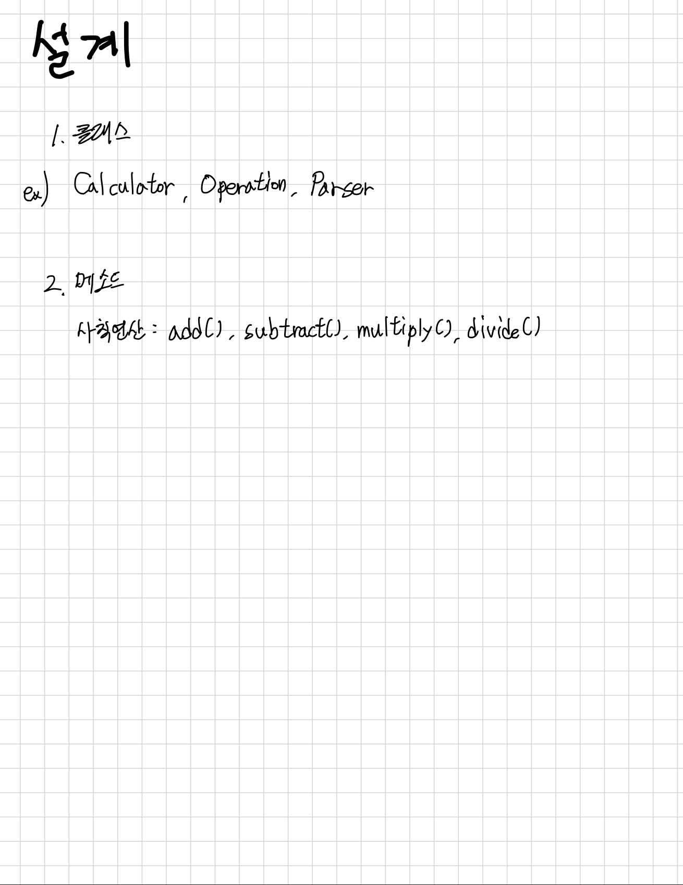

# 자바 계산기 프로젝트

## 목차
1. [프로젝트 소개](#프로젝트-소개)
2. [개발환경 및 기술스택](#개발환경-및-기술스택)
3. [주요기능 소개](#주요기능-소개)

## 프로젝트 소개
- 자바 계산기 프로젝트
- 프로젝트 기간 : 2024년 9월 06일 ~  2024년 09월 10일

## 개발환경 및 기술스택
- Backend
  - Java(17)
- Tools
  - IntelliJ, Git, Github, Notion

## 주요기능 소개
###  설계 

### 주요기능
#### Level1
    - Scanner를 활용하여 num1, num2, 사칙연산 기호 입력받고 switch문을 통해서 
      사칙연산 기호가 조건에 해당할때, 조건문 print하기
#### Level2
    - 연산 결과를 저장하는 ArrayList 필드 작성
      private List<Double> resultList = new ArrayList<>;
      List 인터페이스 사용, ArrayList를 나중에 LinkedList나 다른 것으로 변경하고싶을 때
      코드 수정이 간단해서 유연성을 고려하여 선택 
      
    - Level1에서 활용했던 switch문을 Calculator의 arithmeticOperation 메서드 생성 후
      switch문 로직 작성
    - 0으로 곱하기 나누기할때, 연산기호가 다를때 IllegalArgumentException 예외 발생
      연산결과는 List.add 그리고 return하기

    - getter / setter 만들기 
      연산결과를 반환하는 getResultList() 메서드 생성
      연산결과가 없을때 조회 시 IndexOutOfBoundsException 예외처리
      
    - 저장된 연산 결과의 첫번째 데이터를 삭제하는 메서드 추가
      removeResultList() 메서드 생성
      저장된 연산 결과가 없을 때 IndexOutOfBoundsException 예외처리
    

